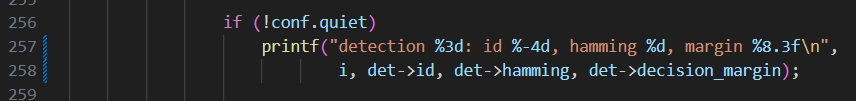

https://github.com/con169/perception-orogen-apriltags
- You can either follow the instructions below or clone from my repo
- Some changes are not listed here so it would be best to clone if you want latest changes

~/dev/rock
`autoproj show opencv`

check if opencv4 is installed, if not do:
`sudo apt update`
`sudo apt install libopencv-dev`

Not needed but you can add opencv to the layout (i forgot how i know this is the format to add to layout)
```
Layout:
	- opencv
```

---
change folder rock/install/include/apriltag to rock/install/include/apriltags

## orogen/apriltags/apriltags.orogen
- using_library
	- apriltags → apriltag
	- opencv → opencv4

## orogen/apriltags/apriltagsTypes.hpp
- change the family_t enum
	- TAG25H7 → TAG16H5
	- remove TAG36ARTOOLKIT

## orogen/apriltags/tasks/task.hpp
remove the includes to tag25h7 and tag36artoolkit
add `#include apriltags/tag16h5`

## orogen/apriltags/tasks/task.cpp
configureHook()
- change case TAG25H7 to case TAG16H5
- tag16h5_create()
- comment out tag36artoolkit case

- comment out refine_decode and refine_pose
	- they don't exist

cleanupHook()
- same as before for configureHook()

updateHook()

the apriltag_detection struct does not have properties: d, h, and goodness anymore. Change the printf to the following:

```cpp
if (!conf.quiet)

                    printf("detection %3d: id %-4d, hamming %d, margin %8.3f\n",

                            i, det->id, det->hamming, det->decision_margin);
```



At this point, try amake so you can see the errors with opencv

OpenCV uses a different variable for the line parameter (POST v4.0.0)
CV_AA is deprecated, in version 4+ they use cv::line_AA

replace CV_AA with cv::LINE_AA

- These changes are needed in:
	- void Task::draw
	- void Task::draw3dCube
	- void Task::draw3dAxis

These should be all of the changes needed to build rock and now you can simple `amake` inside perception/orogen/apriltags or /rock!